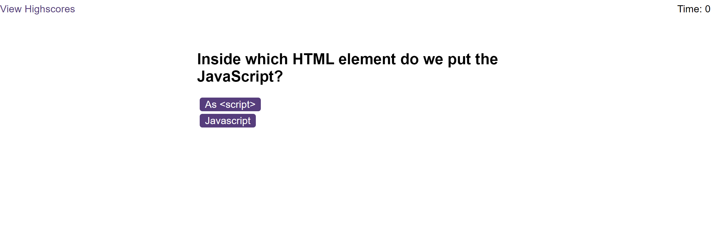
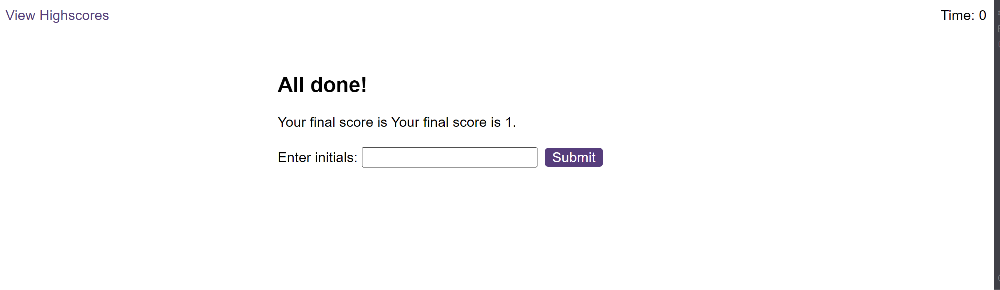

# CODE-QUIZ

ianta.gi
See site [here](https://nadinetsthub.io/Code-Quiz/)

## Overview

This project's requirement was to create a code quiz. This quiz will take the user through different questions. As the user selects an option the score will show at the bottom of each question and it will progress to the next. 

At the end of the test the user will see their final score and they will have the option to insert 3 letters in a text box to save their score and that will be saved in the highscore screen. From the highscore screen the user will see the high scores and will have the ability to clear all highscores.

